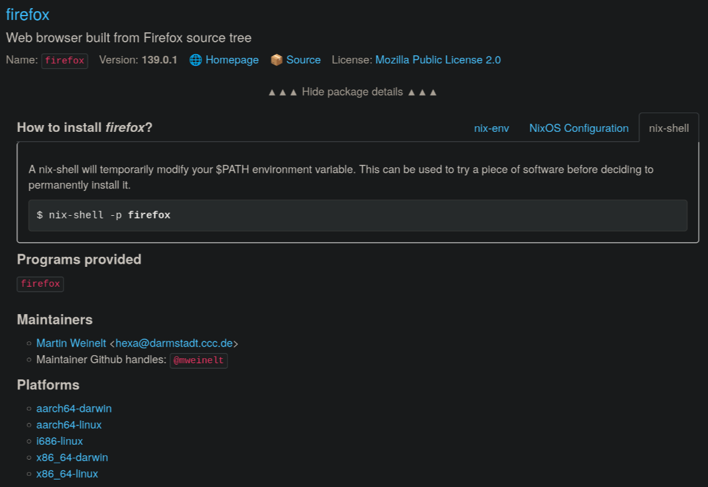

# Nixpkgs

`Nixpkgs` is the massive collection of Nix expressions that define essentially *all* software available for Nix. It's the standard library for Nix, containing tens of thousands of packages. When you interact with `nixpkgs` in your Nix expressions, you're using this vast resource.

## How to Get Packages from Nixpkgs

The simplest way to use a package from Nixpkgs is to import it:

```bash
nix eval --impure --expr 'with import <nixpkgs> {}; pkgs.hello'
```

This evaluates an expression that imports Nixpkgs and makes its contents available as `pkgs`. The result will be a Nix store path for the `hello` package derivation.

You can also use `nix build`:

```bash
nix build nixpkgs#hello
```

This will build and symlink `hello` into your current directory as `result`.

And `nix run`:

```bash
nix run nixpkgs#hello/bin/hello
```
```
Hello, world!
```

> You could also run `./result/bin/hello`.

This command tells Nix to run the `hello` executable from the `hello` package in Nixpkgs.

## Searching Nixpkgs

You can search for packages directly from your terminal:

```bash
nix search nixpkgs firefox
```

This command will list all packages in your Nixpkgs channel that contain "firefox" in their name or description. You'll likely see results like `firefox` and `firefox-bin`.

However, the CLI is slow and not convenient to use. You should use the [Nixpkgs search](https://search.nixos.org/packages?channel=unstable) instead.

This is the entry of Firefox in Nixpkgs:



### How to install *firefox*?

You can use Nix as a traditional package manager:

```bash
nix-env -iA nixpkgs.firefox
```

This is **not recommended** as packages installed this way must be updated and maintained by the user in the same way as with a traditional package manager. To temporarily install a package for testing purposes, use `nix-shell` instead:

```bash
nix-shell -p firefox
```

This will spawn a shell with `firefox` available. To permanently install a package with Nix, add it to your NixOS or Home Manager configuration. NixOS and Home Manager will be covered later in this guide.

## `pkgs.lib` utility functions

The `pkgs` argument (or `nixpkgs` itself) isn't just a list of applications; it also provides a powerful utility library called `pkgs.lib`. This library contains helper functions for working with Nix expressions, strings, lists, and more.

Many of these functions are used extensively within Nixpkgs itself to define packages and modules. You can browse the full [`pkgs.lib` documentation online](https://nixos.org/manual/nixpkgs/stable/#sec-functions-library) for more details.

## The Nixpkgs GitHub Repository

Nixpkgs is an open-source project hosted on GitHub: [github.com/NixOS/nixpkgs](https://github.com/NixOS/nixpkgs). You can explore its source code to see how packages are defined. Every package definition is a Nix expression!

For example, you could find the definition for `hello` at `pkgs/by-name/he/hello/package.nix`. It uses `stdenv.mkDerivation` just like our example.

## Binary Caches

Building everything from source every time can be slow. Nix solves this with **binary caches**. When someone builds a derivation, if that exact derivation (with its exact hash) has already been built and uploaded to a binary cache (like [`cache.nixos.org`](https://cache.nixos.org/)), Nix will simply *download* the pre-built binaries from the cache instead of building it locally.

This is possible because of the unique hashing of store paths. If the hash matches, the content *must* be identical, so a downloaded binary is guaranteed to be the same as one built locally. This significantly speeds up package installation and system updates.
